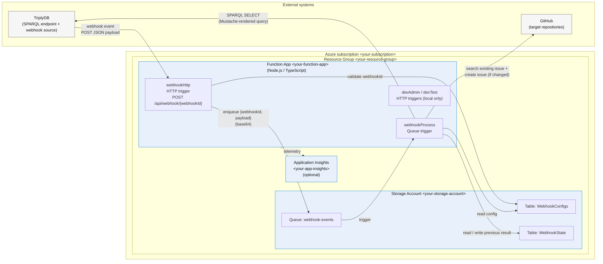
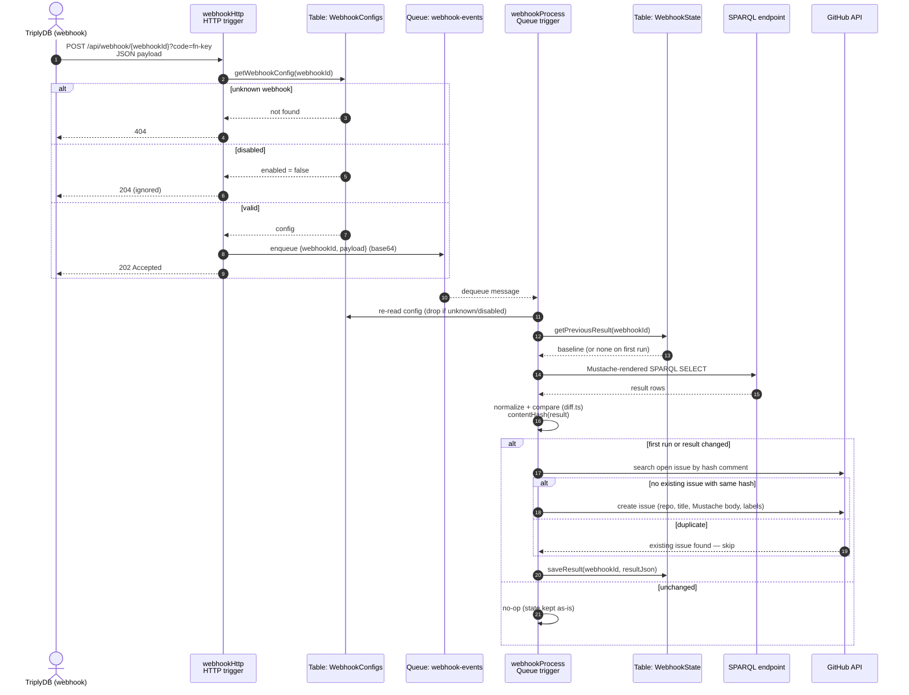
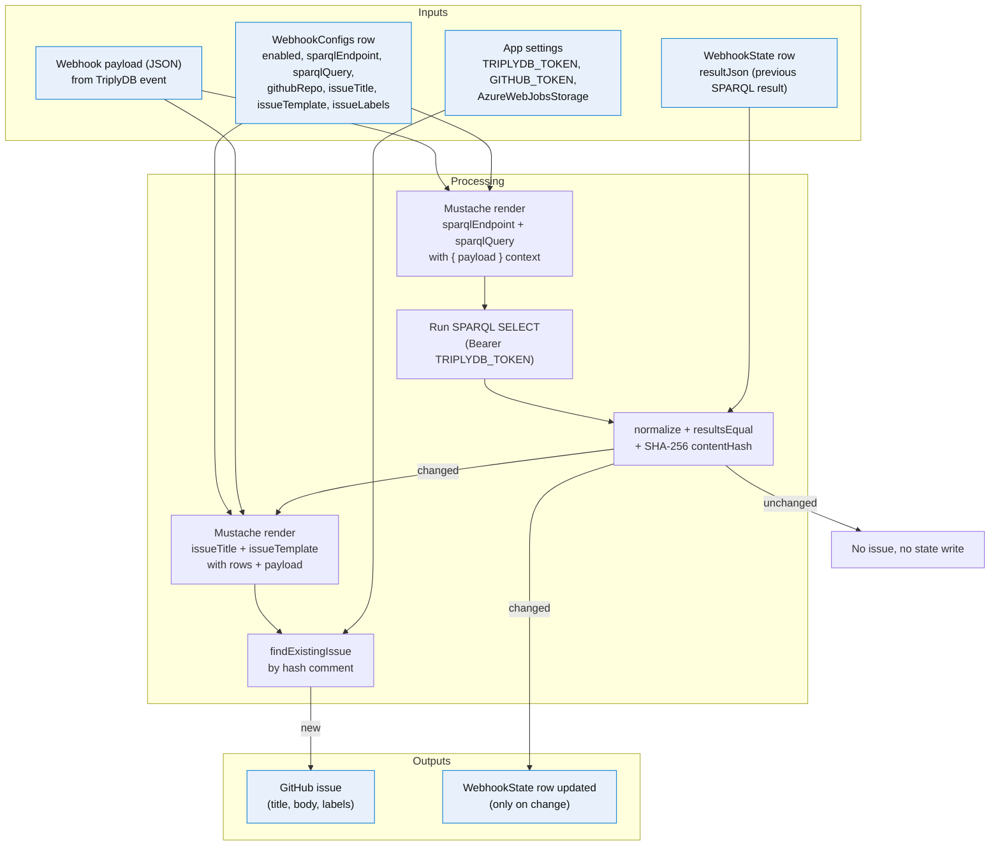
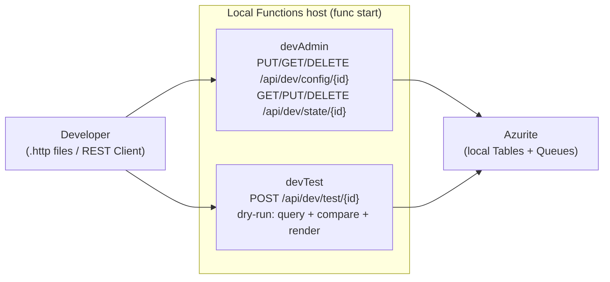

# Architecture

> Replace the `<...>` placeholder names below with your actual Azure resource
> names (Function App, Storage Account, App Insights, etc.) before publishing.

## System architecture

## Request flow

## Data flow

## Dev / testing endpoints (local only)

